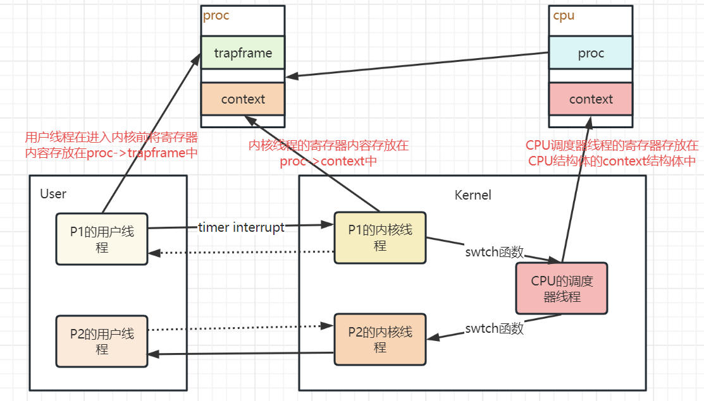
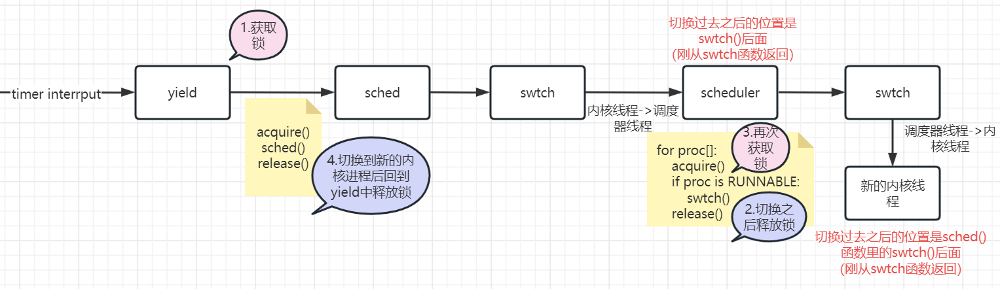

## 线程切换





## Uthread: switching between threads

> 针对用户级的线程系统设计并实现一个上下文切换

理解了`lecture`中的线程切换就比较简单，基本上模仿内核模式写就行了。

```c
struct thread{
    char 			stack[STACK_SIZE];
    int				state;
    struct context  context; // 增加一个线程上下文 内容和kernel下的context一致
};

void
thread_create(void (*func)())
{
	...
    // 设置该线程运行的函数
  	t->context.ra = (uint64)func;
    t->context.sp = (uint64)(t->stack + PGSIZE);
}

// thread_schedule
thread_switch((uint64)&t->context, (uint64)&current_thread->context);

// thread_switch内容和kernel下的swtch一致
```

> 疑难点：设置线程运行函数那一个地方还是需要理解一下（当然`lecture`中以及`xv6`中也有相应的部分可以参考），就是为什么设置了两个寄存器就可以了？<font color='red'>因为每次切换上下文之后返回的都是当前`ra`寄存器指向的位置，所以想要使函数可以运行在对应线程上，只要设置该线程`context`里的`ra`寄存器。`sp`寄存器是为函数的运行分配栈空间。</font>

## Using threads

> 解决多线程读写哈希表（数组+链表）引发的`race-condition`

现象产生的原因：阅读`ph.c`中代码可以发现，针对一个新的key，是会插入这个key对应桶中链表的头部。但是一旦有两个进程并发执行，而不加措施，就会有`entry`丢失。

```c
 static void 
 insert(int key, int value, struct entry **p, struct entry *n)
 {
   struct entry *e = malloc(sizeof(struct entry));
   e->key = key;
   e->value = value;
   e->next = n; // 如果两个线程都在执行完这条语句之后中断，之后无论哪个进程执行下一条语句，都会有一个entry丢失。因为此时两个entry同时指向原链表的表头。
   *p = e;
 }
```

解决方案：**加锁**

```c
// 全局声明
pthread_mutex_t lock;

// main函数里 初始化lock
pthread_mutex_init(&lock, NULL);

// 在 put 函数的 调用insert函数的语句前后 加锁和解锁
pthread_mutex_lock(&lock);
insert(...);
pthread_mutex_unlock(&lock);
```

> 加锁的粒度：经过思考可以发现，很多情况下是不需要加锁的，真正产生冲突的原因是insert函数，所以最小的锁粒度应该针对每一次的`insert`函数。

## Barrier

> 实现一个同步点：所有的线程要等待其他线程到达该点

> 需要学习一下`xv6`中的`sleep`和`wakeup`函数（lecture 13）

```c
static void 
barrier()
{
  // YOUR CODE HERE
  //
  // Block until all threads have called barrier() and
  // then increment bstate.round.
  //
    
  // 首先需要获取锁，因为需要修改bstate.nthread
  // 这个场景和lecture中解决lost wakeup问题的场景很像
  // 都是在外面获取锁，在sleep(wait)里面释放锁，从而避免了一个时间窗口使得先wakeup然后sleep
  pthread_mutex_lock(&bstate.barrier_mutex);
  bstate.nthread++;
  if (bstate.nthread != nthread) {
    pthread_cond_wait(&bstate.barrier_cond, &bstate.barrier_mutex);
  } else { // 注意: 由于是if-else结构，所以只有最后一个到达barrier的线程才会执行else部分
      // 其他都被阻塞，唤醒之后直接释放锁退出了
    bstate.nthread = 0;
    bstate.round ++;
    pthread_cond_broadcast(&bstate.barrier_cond);
  }
  pthread_mutex_unlock(&bstate.barrier_mutex);
}
```